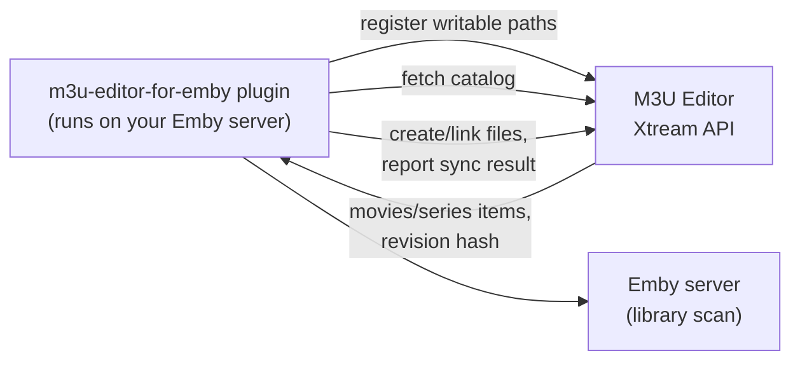

# Managed Emby Library Publishing

While [Emby Integration](./emby_integration.md) *imports* content from an existing Emby library into M3U Editor, Managed Library Publishing works in the opposite direction: it **publishes** VOD/series content that M3U Editor already knows about (from a playlist group, a series category, or a custom playlist) out to Emby as a library that Emby manages and scans like any other.

:::info Requires a companion Emby plugin
This feature is protocol-only on the M3U Editor side. The actual file placement and Emby library scanning is performed by a separate, community-maintained Emby plugin: [m3u-editor-for-emby](https://github.com/Serph91P/m3u-editor-for-emby), installed on your Emby server. M3U Editor exposes the catalog and accepts sync results; it does not write to Emby's filesystem directly.
:::

## How it works

1. The Emby plugin registers its writable output paths with M3U Editor over the Xtream API.
2. You create one or more **Managed Library** mappings in M3U Editor, each pointing a content source at an Emby library and one of the plugin's registered output paths.
3. The plugin periodically fetches the catalog for its mappings, creates/links the companion files Emby expects, and reports success/failure back to M3U Editor, which is reflected as each mapping's status.

## Prerequisites

- An Emby [Media Server Integration](./emby_integration.md) already configured in M3U Editor, enabled, and of type **Emby** (not Jellyfin, this feature is Emby-specific).
- The [m3u-editor-for-emby](https://github.com/Serph91P/m3u-editor-for-emby) plugin installed on your Emby server.
- The `use_integrations` permission on your M3U Editor user account.

## Configuring a Managed Library

1. Navigate to **Media Server Integrations** → open your Emby integration.
2. Go to the **Managed Libraries** tab.
3. Click **Create mapping** and configure:

### Source

| Field | Description |
|---|---|
| **Source type** | `VOD group`, `Series category`, `Custom playlist group`, or `All eligible items` |
| **Source** | The specific group, category, or custom playlist to publish (skipped for "All eligible items") |
| **Library type** | `Movies` or `TV shows`; determines whether VOD groups or series categories are eligible |
| **Mapped group** | Auto-filled for most source types; for **Custom playlist group** you additionally pick the specific group/category inside that playlist to publish |

### Emby Library

| Field | Description |
|---|---|
| **Existing library** | Point at a library Emby already has, or leave blank to create a new one |
| **Library name** | Name for the Emby library (auto-filled when an existing library is selected) |
| **Companion output path** | Where the plugin writes companion files. Limited to paths the plugin itself has registered as writable; you can't type an arbitrary path |
| **Create and manage this Emby library** | When enabled, M3U Editor treats the library as fully managed (created if missing, and reconciled if its config drifts) |
| **Enabled** | Turn the mapping on/off without deleting it |

### Publishing Options

| Field | Description |
|---|---|
| **Naming** | `Title and year` or `Title only` for generated file/folder names |
| **Cleanup** | `Replace stale managed files`, `Keep stale managed files`, or `Do not clean up files`; controls what happens to previously-published files that are no longer in the catalog |
| **Publish local NFO** | Include `.nfo` metadata sidecar files |
| **Publish visible versions** | Include multiple quality/version variants when available, rather than just one |
| **Refresh Emby after successful sync** | Trigger an Emby library refresh once the plugin finishes syncing |

## Managing mappings

Each row in the **Managed Libraries** table has:

- **Status** badge: `idle`, `pending`, `planned`, `synced`, `failed`, or `drifted` (drifted means the actual Emby library's config no longer matches what the mapping expects, e.g. an admin manually edited paths/type in Emby; this is surfaced rather than auto-corrected)
- **Applied revision**: the content hash of the catalog that was last successfully synced
- **Last success**: when the plugin last reported a successful sync
- **Reconcile**: re-plans the mapping (creates the Emby library if `is_managed` and missing, or detects drift on an existing one)
- **Preview**: shows the exact catalog plan (items, revision hash) that the plugin will act on, capped at 50 items in the UI for large libraries (the full list is still what's hashed and synced)

## Granting access to Playlist Auth credentials

By default, only the playlist owner (`owner_auth`) can drive this protocol. To let a specific **Playlist Auth** credential's Emby plugin also read catalogs and report sync results, open that Playlist Auth and enable **Library Publishing Access → Enable Library Publishing**. This is off by default and only visible to users with the `use_integrations` permission.

## Related Documentation

- [Emby Integration](./emby_integration.md) - Importing content from Emby/Jellyfin
- [Media Server Integrations](./overview.md) - Integrations architecture overview
