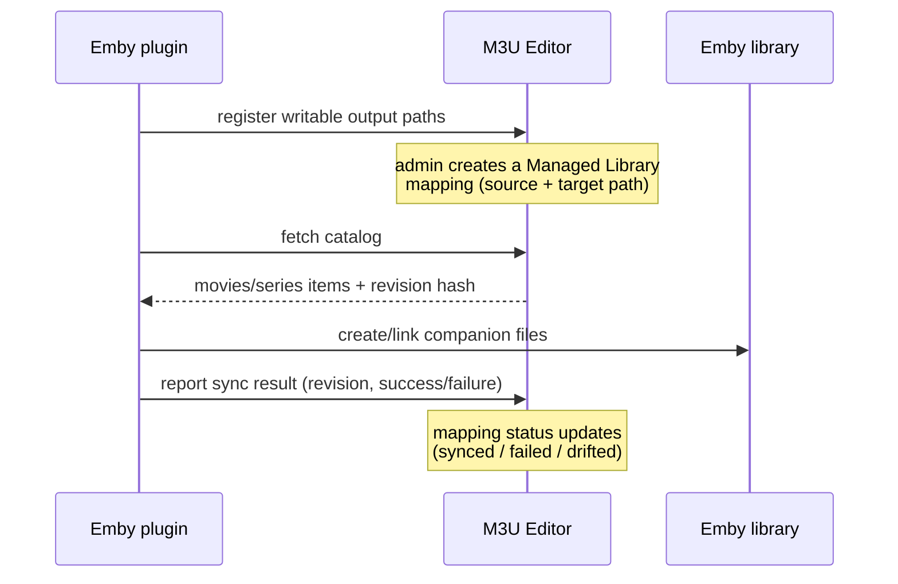

# Emby Library Publishing

The [Emby integration](./emby_integration.md) *imports* content from Emby into M3U Editor. Library publishing works the other way: it **publishes** VOD/series content that M3U Editor already knows about (from a playlist group, a series category, or a custom playlist) out to Emby as a library that Emby manages and scans like any other.

:::info Requires a companion Emby plugin
This feature is protocol-only on the M3U Editor side. The actual file placement and Emby library scanning is performed by a separate, community-maintained Emby plugin: [m3u-editor-for-emby](https://github.com/Serph91P/m3u-editor-for-emby), installed on your Emby server. M3U Editor exposes the catalog and accepts sync results; it does not write to Emby's filesystem directly.
:::

## How it works

```mermaid
sequenceDiagram
    participant Plugin as Emby plugin
    participant M3UE as M3U Editor
    participant Emby as Emby library

    Plugin->>M3UE: register writable output paths
    Note over M3UE: admin creates a Managed Library<br/>mapping (source + target path)
    Plugin->>M3UE: fetch catalog
    M3UE-->>Plugin: movies/series items + revision hash
    Plugin->>Emby: create/link companion files
    Plugin->>M3UE: report sync result (revision, success/failure)
    Note over M3UE: mapping status updates<br/>(synced / failed / drifted)
```

1. The Emby plugin registers its writable output paths with M3U Editor over the Xtream API.
2. You create one or more **Managed Library** mappings in M3U Editor, each pointing a content source at an Emby library and one of the plugin's registered output paths.
3. The plugin periodically fetches the catalog for its mappings, creates/links the companion files Emby expects, and reports success/failure back to M3U Editor, which is reflected as each mapping's status.

## Prerequisites

- An Emby [Media Server Integration](./emby_integration.md) already configured in M3U Editor, enabled, and of type **Emby** (not Jellyfin, this feature is Emby-specific).
- The [m3u-editor-for-emby](https://github.com/Serph91P/m3u-editor-for-emby) plugin installed on your Emby server.
- The **Use Integrations** permission on your M3U Editor user account.

## Publishing Groups and Categories (Quick Start)

The quickest way to publish content is the **Publish to Emby** action:

1. Navigate to **Integrations → Media Servers** → open your Emby integration.
2. Go to the **Managed Libraries** tab and click **Publish to Emby**.
3. **What do you want to publish?** Choose **Movies** or **TV shows**.
4. Select one or more **Movie groups** or **Series categories**. Sources that are already published aren't offered again. Matching Custom Playlist groups are included.
5. Choose the **Destination**:
   - **Use an existing Emby library**: its name, type, and management settings are kept. If it's a **Mixed Content** library, choose which content type this mapping publishes.
   - **Create a managed Emby library**: enter a **Library name** and pick a **Companion output path**. M3U Editor creates and manages the library.
6. Set the [publishing options](#publishing-options) and confirm.

Each selected group or category gets its own mapping and subfolder, all published in one step. Turn on **Publish all eligible items as one source** instead if you want a single mapping for everything. If any part of the publish fails, nothing is saved.

## Configuring a Managed Library

For finer control (for example a Dynamic Group source), create a single mapping:

1. Navigate to **Integrations → Media Servers** → open your Emby integration.
2. Go to the **Managed Libraries** tab.
3. Create a mapping and configure:

### Source

| Field | Description |
|---|---|
| **Source type** | `VOD group`, `Series category`, `Dynamic Group`, `Custom playlist group`, or `All eligible items` |
| **Source** | The specific group, category, or custom playlist to publish (skipped for "All eligible items") |
| **Library type** | `Movies` or `TV shows`; determines whether VOD groups or series categories are eligible. For an existing **Mixed Content** library, choose the content type this mapping publishes. |
| **Mapped group** | Auto-filled for most source types; for **Custom playlist group** you additionally pick the specific group/category inside that playlist to publish |

### Emby Library

| Field | Description |
|---|---|
| **Existing library** | Point at a library Emby already has, or leave blank to create a new one |
| **Library name** | Name for the Emby library (auto-filled when an existing library is selected) |
| **Companion output path** | Where the plugin writes companion files. Limited to paths the plugin itself has registered as writable; you can't type an arbitrary path |
| **Create and manage this Emby library** | When enabled, M3U Editor treats the library as fully managed (created if missing, and reconciled if its config drifts) |
| **Enabled** | Turn the mapping on/off without deleting it |

### Publishing Options

| Field | Description |
|---|---|
| **Naming** | `Title and year` or `Title only` for generated file/folder names |
| **Cleanup** | `Replace stale managed files`, `Keep stale managed files`, or `Do not clean up files`; controls what happens to previously-published files that are no longer in the catalog |
| **Publish local NFO** | Include `.nfo` metadata sidecar files |
| **Publish visible versions** | Include multiple quality/version variants when available, rather than just one |
| **Refresh Emby after successful sync** | Trigger an Emby library refresh once the plugin finishes syncing |

### Dynamic Groups as a Source

Active [Dynamic Groups](./tmdb_integration.md#dynamic-groups) (Trending, Popular, Top Genre, and so on) can be published too. VOD Dynamic Groups map to movie libraries and series Dynamic Groups to TV show libraries. The published items follow the group's current membership, so the Emby library updates as the list changes. This publishes an ordinary Emby library; it doesn't create native Emby or Jellyfin Collections.

## Managing mappings

Each row in the **Managed Libraries** table has:

- **Status** badge: `idle`, `pending`, `planned`, `synced`, `failed`, or `drifted` (drifted means the actual Emby library's config no longer matches what the mapping expects, e.g. an admin manually edited paths/type in Emby; this is surfaced rather than auto-corrected)
- **Applied revision**: the content hash of the catalog that was last successfully synced
- **Last success**: when the plugin last reported a successful sync
- **Reconcile**: re-plans the mapping (creates a managed Emby library if it's missing, or checks an existing one for drift)
- **Preview**: shows the exact catalog plan (items, revision hash) that the plugin will act on, capped at 50 items in the UI for large libraries (the full list is still what's hashed and synced)

## Granting access to Playlist Auth credentials

By default, the plugin signs in with the playlist owner's login. To let it use a [Playlist Auth](/docs/resources/playlist-auth) instead, open that Playlist Auth and turn on **Library Publishing Access → Enable Library Publishing**. It's off by default, and only shown to users with the **Use Integrations** permission.

## Troubleshooting Managed Setup

*(v0.13.2+)* If managed setup fails, M3U Editor shows the actual cause instead of a generic "install the companion" prompt:

| Message | What to check |
|---|---|
| Managed setup could not connect | Emby is reachable from M3U Editor (URL, port, Docker networking) |
| Emby rejected the managed setup request | The administrator credential and its permissions |
| The managed setup endpoint was not found | The companion plugin is installed correctly |
| The companion does not support managed setup version 1 | Update the companion plugin |
| Emby is not ready for managed setup, or returned an invalid response | The companion plugin's configuration |
| Binding conflict | Reconnect the integration, then retry |
| Blocked by the integration security policy | The integration's security settings |

Retry setup once you've fixed the cause.
