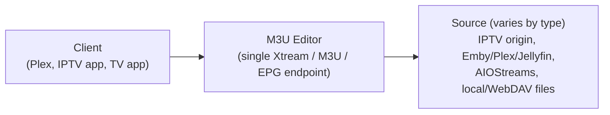
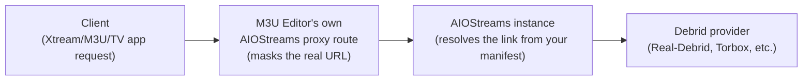
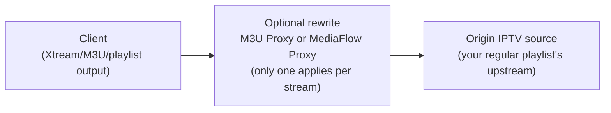
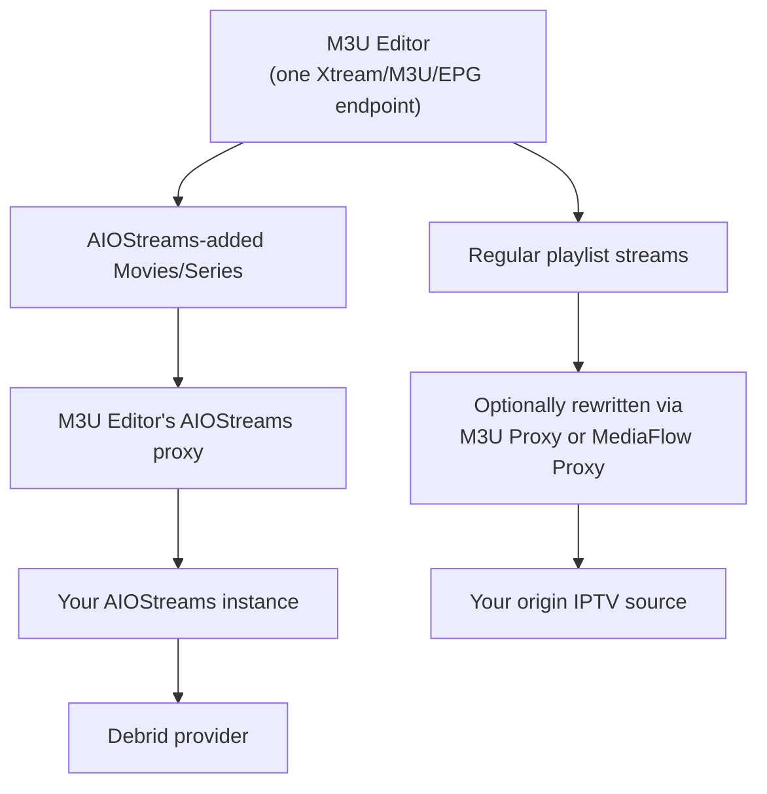

# Integrations Overview

M3U Editor sits in the middle of every request. Whatever the source — a regular IPTV playlist, an Emby/Plex/Jellyfin library, or an on-demand AIOStreams catalog — your client (Plex, an Xtream/M3U app, or the M3U Editor TV app) only ever talks to **M3U Editor**. It never talks to the upstream source directly.

A common point of confusion is **AIOStreams + MediaFlow Proxy**, since both are "proxy-like" things you configure. They are unrelated, parallel paths — one is never chained through the other.

:::warning Same setting name, two unrelated places
"MediaFlow Proxy" exists as a setting in **two different, unrelated systems**:
- **AIOStreams' own** `Proxy` configuration page — governs how *AIOStreams itself* resolves debrid streams internally.
- **M3U Editor's own** `Preferences → MediaFlow Proxy` — rewrites M3U Editor's *own generated* playlist/Xtream/EPG output.

Configuring one has zero effect on the other. If you're troubleshooting a MediaFlow issue, always check which system's setting you actually mean — M3U Editor never reads or writes AIOStreams' MediaFlow/Proxy config, and vice versa.
:::

## AIOStreams flow

AIOStreams is a *source* you add under **Integrations → Media Server Integrations**, not a destination you route other traffic through. M3U Editor always resolves AIOStreams streams itself and masks the real (debrid) URL before it ever reaches a client:

Nothing here touches MediaFlow. Your self-hosted AIOStreams instance's own proxy/MediaFlow settings govern how *it* resolves debrid links internally — M3U Editor doesn't see or need to change that layer. Setup is just: paste your AIOStreams **manifest URL** into the integration. See [AIOStreams Integration](./aiostreams_integration.md).

## M3U Proxy / MediaFlow flow

M3U Proxy (the [Proxy](../proxy/overview.md) system) and MediaFlow Proxy are optional, global settings (**Preferences → MediaFlow Proxy**) that apply to M3U Editor's **own generated output** — regular playlists, merged/custom playlists, and Xtream/EPG streams. They're typically used to mask your server's IP/headers from upstream IPTV providers:

This leg is independent of AIOStreams — enabling it doesn't affect AIOStreams playback, and you don't need it for AIOStreams to work at all.

## Putting it together

If you use both AIOStreams and regular IPTV playlists with MediaFlow, the two flows simply run side by side through the same M3U Editor instance — they don't merge into a single chain:

Nothing needs to be disabled on your self-hosted AIOStreams instance to use it with M3U Editor, and MediaFlow only needs to be configured if you separately want your *regular* playlist output routed through it.
