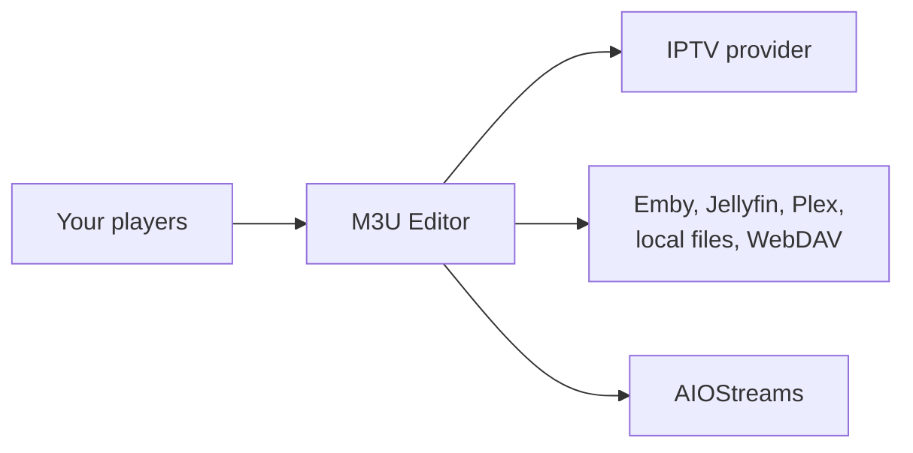

import LinkCards from '@site/src/components/LinkCards';

# Integrations Overview

Integrations connect M3U Editor to other services: your media servers, TMDB for metadata, Sonarr and Radarr for downloads, and more. All of them are optional. Each one adds content or features to your playlists, and your players still only ever talk to M3U Editor.

| Integration | Adds | Set it up in |
|---|---|---|
| [TMDB](tmdb_integration) | Metadata, artwork, ratings, Trending and genre groups for movies and series | **Settings → Integrations** |
| [DVR](dvr_integration) | Recording live TV from the guide | A playlist's **DVR** tab |
| [Media servers](emby_integration_settings) | Movies and series from Emby, Jellyfin, Plex, local folders, or WebDAV, served alongside your IPTV content | **Integrations → Media Servers** |
| [Emby Library Publishing](emby_library_publishing) | Your M3U Editor movies and series as Emby libraries | An Emby media server's **Managed Libraries** tab |
| [Networks](media_networks_integration) | 24/7 live channels built from your media server's content | **Integrations → Networks** |
| [Sonarr and Radarr](arrs_integration) | Requesting shows and movies, for you and your guests | **Integrations → Media Servers → Sonarr & Radarr** |
| [AIOStreams](aiostreams_integration) | On-demand movies and series from debrid services | **Integrations → Media Servers** |
| [MediaFlow Proxy](/docs/advanced/settings-reference#mediaflow-proxy) | An alternative to M3U Proxy for routing your playlists | **Settings → Integrations** |

Most integrations need the **Use Integrations** permission on your user account, which admins have.

## How streams flow

Every source, whether an IPTV provider, a media server, or AIOStreams, reaches your players through M3U Editor. The player never sees the source's address or credentials.

```mermaid
flowchart LR
    Player["Your players"] --> M3UE["M3U Editor"]
    M3UE --> IPTV["IPTV provider"]
    M3UE --> Media["Emby, Jellyfin, Plex,<br/>local files, WebDAV"]
    M3UE --> AIO["AIOStreams"]
```

M3U Proxy, or MediaFlow Proxy, can sit between M3U Editor and your IPTV provider to share connections and transcode. Media server and AIOStreams content has its own route and doesn't need either one.

:::note Two different "MediaFlow" settings
AIOStreams has its own MediaFlow proxy setting, which controls how AIOStreams fetches from debrid services. It's unrelated to M3U Editor's **MediaFlow Proxy** setting, which routes your playlists. Changing one never affects the other.
:::

## Start here

<LinkCards
  items={[
    { to: '/docs/integrations/tmdb_integration', icon: 'movie', title: 'TMDB', text: 'The one most people add first: artwork, ratings, and smart groups.' },
    { to: '/docs/integrations/emby_integration_settings', icon: 'video_library', title: 'Media servers', text: 'Bring in your own movie and TV libraries.' },
    { to: '/docs/integrations/dvr_integration', icon: 'fiber_smart_record', title: 'DVR', text: 'Record shows from the guide.' },
    { to: '/docs/integrations/arrs_integration', icon: 'download', title: 'Sonarr and Radarr', text: 'Let people request what they want to watch.' },
  ]}
/>
