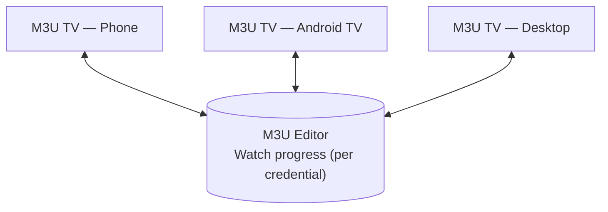

# Continue Watching

Continue Watching lets you stop a movie or episode on one device and pick up exactly where you left off on another — switch from your phone on the couch to Android TV without losing your spot. It was built primarily for M3U TV, but the mechanism behind it is entirely server-side.

## Why it works across clients

The important design decision is **where playback position is stored**: not on the device, but on your M3U Editor instance itself.

Every client that connects with the **same credential** (a Playlist or Playlist Auth) reads and writes to the same watch-progress record on the editor. There's no per-device local state to fall out of sync — the editor is the single source of truth, so "Continue Watching" looks identical no matter which client you open it from.

## What's tracked

- **VOD and episodes**: playback position and duration are periodically reported while playing, so a paused item can resume from the same second later.
- **Live channels**: no position is meaningful for live TV, so tuning in just records a "watched" tally and last-watched timestamp instead — useful for a "recently watched channels" view, not for resuming.
- **Completion**: an item is automatically marked completed once playback passes roughly 90% of its duration, so finished content naturally drops out of Continue Watching.

Progress is scoped per credential (not globally per-user), matching how M3U Editor already scopes everything else — if you have multiple Playlist Auths (e.g. one per family member), each has its own independent Continue Watching list.

## AIOStreams content

Continue Watching also covers content played through an [AIOStreams integration](../integrations/aiostreams_integration.md). Since AIOStreams items don't have a local Channel/Episode row to join against, the editor stores a bit of denormalized metadata (title, artwork, plot) alongside the progress record so it can still be displayed without a live lookup back to AIOStreams.

## Nothing to configure

Continue Watching has no toggle — it's a natural side effect of M3U TV reporting playback progress to your editor instance as you watch. There's nothing to opt into beyond using M3U TV itself, and no separate service or third party is involved (compare this to [Push Notifications](./push-notifications.md), which does involve an external relay).
