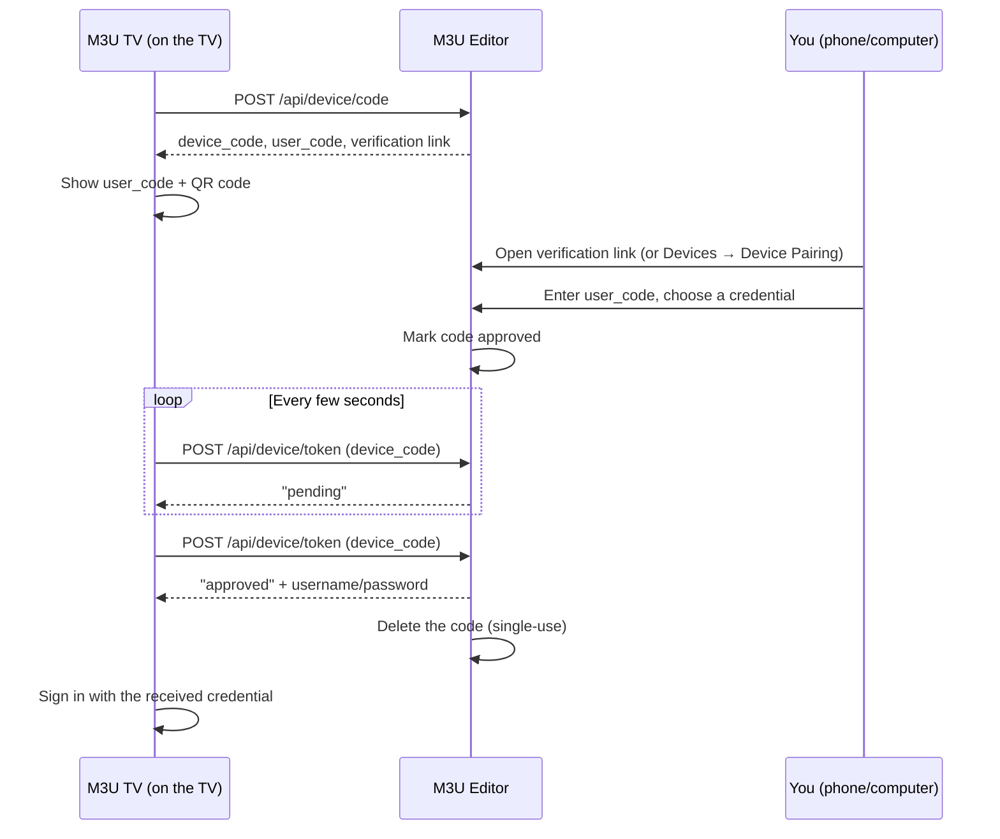

# Device Pairing

Typing a username and password with a TV remote is painful. Device Pairing lets a TV show a short code instead — you enter that code from your phone or computer (already logged into M3U Editor), pick which credential to hand it, and the TV connects automatically. No password ever gets typed on the remote.

The flow follows the same **OAuth 2.0 Device Authorization Grant** pattern ([RFC 8628](https://datatracker.ietf.org/doc/html/rfc8628)) used by services like Trakt, Netflix, and YouTube's TV apps — a well-understood, purpose-built design for exactly this "input-constrained device" problem.

## How it works

1. The TV requests a pairing code and gets back two values: a long, random **device code** (never shown to a human) and a short **user code** (e.g. `XKQP-9F3T`) that's easy to read off a screen or scan as a QR code.
2. You open M3U Editor from a phone or computer that's already logged in, enter the code, and choose which existing credential (Playlist or Playlist Auth) the TV should sign in with.
3. Meanwhile, the TV polls in the background every few seconds asking "has this been approved yet?"
4. Once you approve, the next poll gets back that credential's username and password, and the TV connects — exactly as if you'd typed them in manually.

:::info Nothing new is created
Pairing doesn't mint a special new credential for the TV. It hands back the username/password of a credential you already have — the same one you'd use for any other client. The TV ends up in exactly the same state as if you'd typed that password in by hand.
:::

## Security design

Every piece of this flow is deliberately built to resist abuse:

| Property | How it's enforced |
|---|---|
| **Codes can't be brute-forced** | The device code is a 64-character high-entropy token, never displayed to a human. The user code is short (for readability) but only usable from an *already-authenticated* admin session — there's no way to submit it without being logged in. |
| **Short-lived** | Every code expires after 10 minutes. |
| **Single-use** | The moment a code is approved and the credential is handed back once, the record is deleted. A stolen or replayed `device_code` can never be polled again for credentials. |
| **No enumeration** | The poll endpoint never returns a 404 for an unknown code — unknown, pending, and not-yet-approved codes all look identical from the outside, so the endpoint can't be used to fish for valid codes. |
| **Rate limited** | Both the code-request and poll endpoints are throttled per IP. Polling too aggressively causes the server to slow the TV's own poll interval down automatically. |
| **Approval is locked down** | Repeated wrong-code attempts from the admin panel trigger a 10-minute lockout, scoped to your own admin account. |
| **Ownership re-checked server-side** | Even if a request were tampered with, the server independently re-verifies that the credential you're granting actually belongs to you before approving — the client's selection is never trusted blindly. |

None of this is exposed as configuration — it's just how the endpoints behave.

## Turning it off

Device Pairing is **on by default**. If you'd rather not expose it at all, disable it from **Settings → TV App → Device Pairing → Enable device pairing**. Disabling it:

- Immediately rejects any in-flight pairing requests (the API returns 404)
- Hides the "Device Pairing" tab under **Devices**

Device Pairing also requires **enhanced Xtream API output** ("Enhanced output enabled" under **Settings → General**) to be turned on, since every M3U TV feature depends on it — pairing is automatically unavailable if that's off, regardless of its own toggle.
