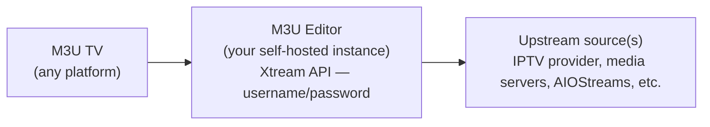

# M3U TV

**M3U TV** is a free, cross-platform front-end player built to sit on top of M3U Editor. It's a native app — Live TV, Movies (VOD), Series, EPG, Search, Favorites, and Continue Watching — that talks to your M3U Editor instance (or any Xtream-compatible provider) over the standard Xtream API.

It's a separate, independently-versioned open-source project from M3U Editor itself, built with [Flutter](https://flutter.dev/) so a single codebase covers TV, mobile, and desktop.

:::danger Enhanced Xtream API output must be enabled
M3U TV **cannot connect at all** unless **Enhanced output enabled** is turned on under **Settings → General** in M3U Editor. It's on by default, but if it's been turned off, every M3U TV feature — playback, EPG, Continue Watching, Device Pairing, Push Notifications — stops working, since they all depend on this extended Xtream API output. If the app can't connect, check this setting first.
:::

:::tip Not required
M3U TV is entirely optional. M3U Editor's generated M3U/Xtream/EPG output works with any compatible player — Kodi, TiviMate, VLC, IPTV Smarters, etc. M3U TV exists for people who want a first-party client with tighter integration (device pairing, push notifications, cross-client Continue Watching) without giving up an open ecosystem.
:::

## Platforms Supported

| Platform | Status | Video Backend |
|---|---|---|
| Android TV | Supported | ExoPlayer via Media3 |
| Android (phone/tablet) | Supported | ExoPlayer via Media3 |
| iOS / iPadOS | Supported | Media Kit, with an AVKit fallback for unsupported media |
| Apple TV (tvOS) | Supported | AVKit |
| Desktop (Linux / Windows) | Supported | libmpv (in-process) |
| Desktop (macOS) | Supported | Media Kit (AVFoundation-backed) |

## Features

- **Live TV** with category filtering and an EPG timeline view
- **Movies (VOD)** and **TV Series**, with season/episode navigation
- **Search** across live channels, movies, and series
- **Favorites** for quick access to the content you watch most
- **Continue Watching** — resume playback where you left off, synced across every device signed in with the same credentials (see [Continue Watching](./continue-watching.md))
- **Device Pairing** — connect a TV without typing a password on the remote (see [Device Pairing](./device-pairing.md))
- **Push Notifications** on mobile — get notified about sync results, recordings, and alerts even when the app is closed (see [Push Notifications](./push-notifications.md))
- **Localization** — English, German, Spanish, French, and Simplified Chinese

## Download

M3U TV is distributed via GitHub Releases:

**[github.com/m3ue/m3u-tv/releases](https://github.com/m3ue/m3u-tv/releases)**

Grab the build for your platform (APK for Android/Android TV, IPA/TestFlight for iOS/tvOS, or the desktop binaries) from the latest release. There's also a shortcut to this page from **Settings → TV App → Get the app** inside M3U Editor itself.

:::note Source available, non-commercial license
M3U TV is source-available under **CC BY-NC-SA 4.0** (attribution, non-commercial, share-alike) — same terms as M3U Editor. See the [repository](https://github.com/m3ue/m3u-tv) for the full license and to file issues or contribute.
:::

## Connecting to M3U Editor

M3U TV speaks the same Xtream API that M3U Editor already exposes for every other player, so there's nothing special to configure on the editor side. Two ways to connect:

1. **Device Pairing (recommended for TVs)** — from the app, choose "Pair with code," enter the short code shown on screen into M3U Editor from your phone or computer, and pick which credential to hand the TV. No typing a password with a remote. Full details: [Device Pairing](./device-pairing.md).
2. **Manual entry** — enter your M3U Editor server URL plus a Playlist or Playlist Auth's username/password directly in **Settings**, the same as you would in any Xtream-compatible client.

Once connected, M3U TV is just another Xtream client from the editor's point of view — it has no special privileges and is subject to the same Playlist/PlaylistAuth restrictions as any other player.

## Further Reading

- [Device Pairing](./device-pairing.md) — how the remote-friendly pairing flow works, and why it's safe
- [Push Notifications](./push-notifications.md) — the mobile push relay, and what it does (and doesn't) store
- [Continue Watching](./continue-watching.md) — how playback position is centralized on the editor across every client
