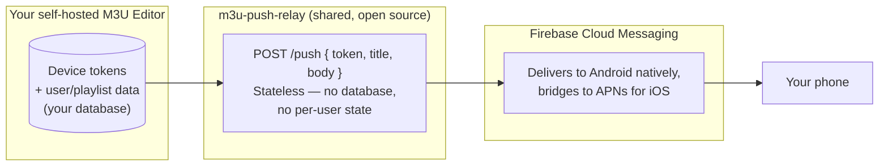

# Push Notifications

M3U TV's mobile builds (phone/tablet — not TV builds) can receive push notifications for things like sync completions, recordings, and alerts, even when the app is closed. Since a self-hosted M3U Editor instance usually isn't reachable directly from Apple's and Google's push services, delivery goes through a small relay.

:::info Mobile only
Push notifications only apply to phone/tablet builds of M3U TV. Android TV and tvOS builds don't register for push — there's no background/closed state to notify on a TV the way there is on a phone.
:::

## Why a relay exists

Apple (APNs) and Google (FCM) push delivery both require a registered, credentialed backend project to hand notifications to — a random self-hosted server can't call either service directly without provisioning its own Firebase/Apple credentials. Rather than asking every self-hoster to set that up, M3U Editor ships pointed at a small, shared, **open-source relay**: [`m3u-push-relay`](https://github.com/m3ue/m3u-push-relay).

## What lives where

This is the part worth being explicit about, since it involves a third-party hop:

- **Your M3U Editor instance** is the only place device tokens and any associated user/playlist data live. It's your own database, on your own server.
- **The relay holds no database and no per-user state at all.** It receives a notification payload (`token`, `title`, `body`, optional `data`), forwards it to Firebase, and forgets it. The only secret *it* holds is a single shared Firebase service account credential — nothing about you, your server, or your content.
- **Firebase Cloud Messaging** is the actual delivery mechanism to both platforms. FCM is required for Android push regardless (Google retired the alternative years ago), and since a Firebase project is needed anyway, the relay uploads the Apple push key into Firebase too — so it never touches Apple credentials directly, and only ever manages one credential for both platforms.

In short: **the relay is a stateless forwarder, not a data store.** Nothing about your account, your library, or your viewers is ever sent to it beyond the single push payload being delivered at that moment.

## Why no auth token on the relay

You might notice `/push` doesn't require an API key. That's intentional, not an oversight: the relay ships inside a **publicly-distributed, open-source app** — any secret baked into a client that ships to end users can't actually stay secret. Instead of a false sense of security from a bundled key, abuse is bounded the way public APIs like this actually should be: **rate limiting**, per source IP and per device token, enforced server-side on the relay itself. A leaked or guessed device token lets someone send a bounded number of pushes to that one device — nothing else.

## Self-hosting your own relay

Since the relay is open source and stateless, you're never required to trust the shared community instance. Point M3U Editor at your own deployment by setting the `PUSH_RELAY_URL` environment variable to your own relay's URL — the relay's [README](https://github.com/m3ue/m3u-push-relay#readme) covers deploying your own copy (it ships as a small Docker image, deployable anywhere).

## Turning it off

Push notifications are **on by default**, pointed at the community relay. Disable them from **Settings → TV App → Push Notifications (Mobile) → Enable push relay**. Registered device tokens that stop checking in are automatically pruned after a configurable number of days (60 by default) regardless of whether the relay itself is enabled.
