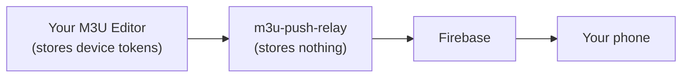

# Push Notifications

M3U TV on phones and tablets can show notifications from M3U Editor, like finished syncs, recordings, and [alerts](/docs/advanced/alerts), even when the app is closed. TV and desktop versions show them while the app is open.

## How it's delivered

Apple and Google only deliver push notifications from registered services, which your own server isn't. So M3U Editor sends them through [m3u-push-relay](https://github.com/m3ue/m3u-push-relay), a small open-source service that passes each notification to Firebase, which delivers it to Android and iOS.

```mermaid
flowchart LR
    Editor["Your M3U Editor<br/>(stores device tokens)"] --> Relay["m3u-push-relay<br/>(stores nothing)"]
    Relay --> FCM["Firebase"]
    FCM --> Phone["Your phone"]
```

- Your device tokens, users, and content stay in your own database.
- The relay has no database. It receives one notification (a device token, a title, and a message), forwards it, and forgets it.
- The relay has no API key, because any key built into a public app wouldn't stay secret. Instead it rate limits by address and by device, so a leaked device token can only be used to send a few notifications to that one device.

To use your own relay instead of the shared one, deploy it from its [README](https://github.com/m3ue/m3u-push-relay#readme) and set `PUSH_RELAY_URL` to its address.

## Settings

All in **Settings → TV App**:

| Setting | What it does |
|---|---|
| **Enable push relay** | Send notifications to phones through the relay. On by default. |
| **Manage Devices** | See registered devices, under **Administration → Devices → Registered Devices**. Devices that stop checking in are removed after 60 days. |
| **Send Push Notification** | Send a test notification to one device. |
| **Send Notification** | Send a message to everyone using a playlist, with a level, a channel, and optionally to admins only. |
| **Notification Channels** | Categories people can subscribe to in the app, so they only get what they care about. |
